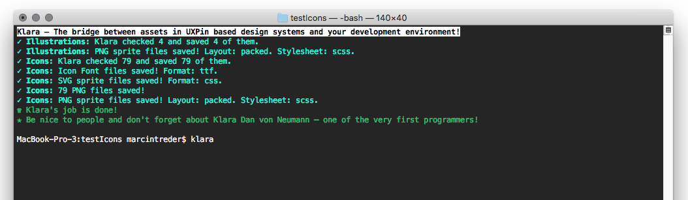

# Klara
## The bridge between assets in design systems stored in <a href="http://uxpin.com">UXPin</a> and your development environment!

Klara is a tool for downloading and managing assets (icons, illustrations...) stored in a design systems created in UXPin app (http://uxpin.com). Klara allows users to download assets and transform them into Icon Fonts, PNGs and SVG and PNG Sprites.

## Mission

UXPin is on the mission to merge design and development into one, smooth, collaborative process. 

Klara is a small step into connecting design and development. Thanks to this simple tool any team can manage assets, such as icons, through a visual interface of a design editor (UXPin) and seamlessly connect it to the git repository

## How to Start?

```
npm install klara
```

Upon the launch Klara is going to ask couple of questions to build a config file (JSON stored in the local directory from which Klara has been launched). The first question (the most important one!) is about the link to a design system stored in UXPin. Klara accepts two kinds of links:
* Link to a design system data JSON file (available in setting of your design system in UXPin). UXPin makes all the data in the design system available as a JSON file stored on UXPin servers and automatically kept up to date. 
* Link to a design system stored in UXPin.

Subsequently, Klara is going to ask about transformations of assets. The choices of:
* Conversion of SVGs to Icon Fonts
* Conversion of SVGs to PNGs
* Conversion of SVGs to SVG Sprites
* Conversion of PNGs to PNG Sprites

Select the options that you want to use by pressing `space bar`. Pressing `enter` will save your answer and move you to the next question.

Next, Klara is going to ask you questions about the file formats and additional configurations of the file transformations of your choice.

## Asset Updates

Whenever an asset (e.g. an icon) in a design system is being changed (added, deleted or modified in any way), launching Klara will cause an update of this changed asset only and regeneration of common transformation files (e.g. sprites or icon font files).

## PNG Conversion – Warning

Conversion of SVG files to PNG files requires a lot of computing resources. Use with caution on larger libraries. FYI: Klara has been tested multiple times with a library of over 1000 icons stored in 10 categories.
